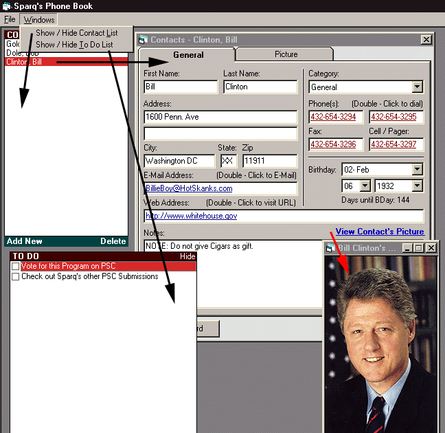



## Contact Manager v5\.0 \- Now with HTML Export and Record Print

### Description

Wow - Im averaging a New version every 1.4 days. Well This version has 2 main features added. 

1. Record printing is now possible 

2. You can export your ENTIRE Phonebook to a fully functioning HTML Web-Phonebook (ONE CLICK TO EXPORT AND VIEW!!!)
 
### More Info
 

             |
---                |---
**Submitted On**   |2000-09-20 11:18:34
**By**             |[Sparq](https://github.com/Planet-Source-Code/PSCIndex/blob/master/ByAuthor/sparq.md)
**Level**          |Intermediate
**User Rating**    |4.7 (47 globes from 10 users)
**Compatibility**  |VB 6\.0
**Category**       |[Complete Applications](https://github.com/Planet-Source-Code/PSCIndex/blob/master/ByCategory/complete-applications__1-27.md)
**World**          |[Visual Basic](https://github.com/Planet-Source-Code/PSCIndex/blob/master/ByWorld/visual-basic.md)
**Archive File**   |[CODE\_UPLOAD100179202000\.zip](https://github.com/Planet-Source-Code/sparq-contact-manager-v5-0-now-with-html-export-and-record-print__1-11568/archive/master.zip)

